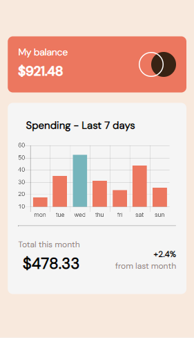
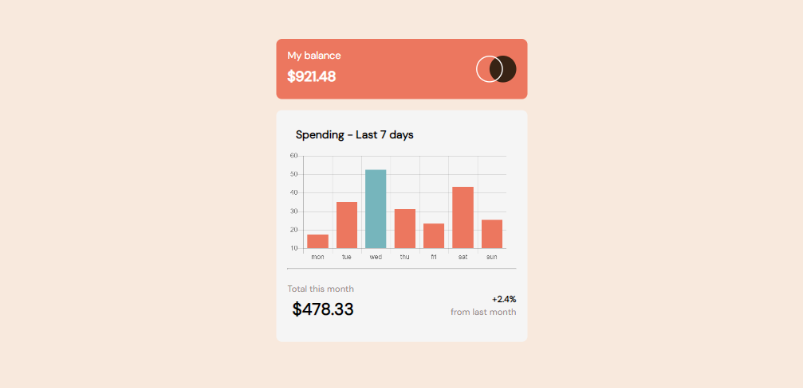

# Frontend-Mentor---Expenses-chart-component-solution
Graphical representation of json information using a bar chart 

This is a solution to the [Expenses chart component challenge on Frontend Mentor](https://www.frontendmentor.io/challenges/expenses-chart-component-e7yJBUdjwt). Frontend Mentor challenges help you to improve your coding skills by building realistic projects. 

## Table of contents

- [Overview](#overview)
  - [The challenge](#the-challenge)
  - [Screenshot](#screenshot)
  - [Links](#links)
- [My process](#my-process)
  - [Built with](#built-with)
  - [What I learned](#what-i-learned)
  - [Useful resources](#useful-resources)
- [Author](#author)

## Overview

### The challenge

Users should be able to:

- View the bar chart and hover over the individual bars to see the correct amounts for each day
- See the current day’s bar highlighted in a different colour to the other bars
- View the optimal layout for the content depending on their device’s screen size
- See hover states for all interactive elements on the page
- **Bonus**: Use the JSON data file provided to dynamically size the bars on the chart

### Screenshot

### Links

- Solution URL: [https://github.com/Vicktuur/Frontend Mentor - Expenses chart component solution](https://github.com/Vicktuur/Frontend_Mentor-Expenses-chart-component-solution)
- Live Site URL: [vicktuur-expenses-chart.com](https://vicktuur-expenses-chart.netlify.com)

## My process

### Built with

- Semantic HTML5 markup
- CSS custom properties
- Flexbox
- Mobile-first workflow
- [JS-chart](https://cdnjs.cloudflare.com/ajax/libs/Chart.js/2.5.0/Chart.js) - JS library

### What I learned

In this project I learned how to plot graphs using a JS library. It is also applicable for plotting pie charts, doughnut charts and other forms of graphical presentations.

### Useful resources

- [W3 Schools](https://www.w3schools.com) - This  platform was really helpful and introduced me to a JS library for the plotting of responsive graphs using json information.

## Author

- Linkedin - [@Abiye-Iniabere](https://www.linkedin.com/in/abiye-iniabere-6715391b3)
- Frontend Mentor - [@Vicktuur](https://www.frontendmentor.io/profile/Vicktuur)
- Twitter - [@Victor_Abiye](https://www.twitter.com/Victor_Abiye)
